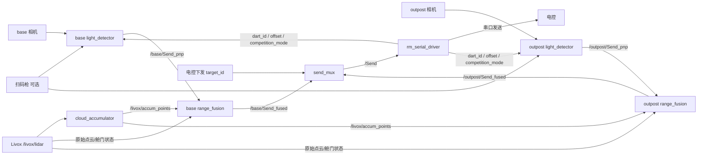

# 飞镖视觉学习路径

本页用于帮助新成员从“能运行项目”逐步达到“能独立定位问题并修改模块”。基础概念见[飞镖视觉相关技术](01_tutorial_wiki_dart.md)，命令和现场操作见[飞镖部署实践手册](03_deployment_dart.md)。

## 1. 项目目标

系统以绿色引导灯检测为视觉入口，使用相机得到目标像素角和 PnP 估计，再结合 Livox 点云估计真实角度、纵向距离和横向距离，最终通过串口提供给电控。系统同时支持双相机目标切换、扫码枪偏置输入、舱门状态判断、延迟监控和赛后内录。

## 2. 总体架构

`target_id=1` 选择基地目标，`target_id=0` 选择前哨站目标。具体 Topic 以 [vision_bringup.launch.py](../../src/vision_bringup/rm_vision_bringup/launch/vision_bringup.launch.py) 和 [node_params.yaml](../../src/vision_bringup/rm_vision_bringup/config/node_params.yaml) 为准。

## 3. 仓库导航

| 目录 | 职责 | 建议先读 |
| --- | --- | --- |
| `src/vision_bringup` | 启动、命名空间、参数覆盖和硬件组织 | [vision_bringup.launch.py](../../src/vision_bringup/rm_vision_bringup/launch/vision_bringup.launch.py) |
| `src/auto_aim/light_detector` | 绿灯检测、PnP、角度滤波和调试图 | [detector_node.cpp](../../src/auto_aim/light_detector/src/detector_node.cpp) |
| `src/rm_livox_fusion` | 点云累积、距离融合、舱门判断和目标选择 | [range_fusion_node.cpp](../../src/rm_livox_fusion/src/range_fusion_node.cpp) |
| `src/auto_aim/auto_aim_interfaces` | 自定义消息 | [Send.msg](../../src/auto_aim/auto_aim_interfaces/msg/Send.msg) |
| `src/rm_serial_driver` | 串口协议、扫码枪和总延迟 | [packet.hpp](../../src/rm_serial_driver/include/packet.hpp) |
| `RECORD` | 选择性内录、空间清理和赛后导出 | [README_RECORD.md](../../RECORD/README_RECORD.md) |

## 4. 第一阶段：运行并观察

### 目标

- 完成依赖安装和编译。
- 能运行无硬件回放或主 Launch。
- 能使用 ROS 2 命令查看节点、Topic 和消息。

### 任务

1. 按[部署实践手册](03_deployment_dart.md)完成编译。
2. 列出运行中的节点和 Topic。
3. 找到图像、`Send_pnp`、`Send_fused` 和最终 `/Send`。
4. 比较 base 与 outpost 命名空间。
5. 记录没有相机、雷达或串口时各节点的表现。

### 完成标准

能够解释一帧图像如何变成串口发送数据，并指出链路中每个节点的输入和输出。

## 5. 第二阶段：阅读视觉检测

### 推荐顺序

1. [detector.hpp](../../src/auto_aim/light_detector/include/detector.hpp)：检测数据结构和接口。
2. [detector.cpp](../../src/auto_aim/light_detector/src/detector.cpp)：颜色、形态学和几何筛选。
3. [pnp_solver.cpp](../../src/auto_aim/light_detector/src/pnp_solver.cpp)：距离和角度解算。
4. [kalman_filter.cpp](../../src/auto_aim/light_detector/src/kalman_filter.cpp)：角度滤波。
5. [detector_node.cpp](../../src/auto_aim/light_detector/src/detector_node.cpp)：ROS 参数、订阅、发布和调试图。

### 需要回答

- 候选绿灯经过哪些筛选条件？
- PnP 使用了什么物理尺寸和相机信息？
- 无目标时哪些字段会恢复为无效状态？
- 双相机下半径和 Topic 为什么不完全由 `node_params.yaml` 决定？
- `debug=true` 会增加哪些额外工作？

## 6. 第三阶段：阅读点云融合

### 推荐顺序

1. [rm_livox_fusion_node.cpp](../../src/rm_livox_fusion/src/rm_livox_fusion_node.cpp)：滑窗点云累积。
2. [range_fusion_node.cpp](../../src/rm_livox_fusion/src/range_fusion_node.cpp)：投影、选点、稳健测距、滤波和舱门状态。
3. [send_mux_node.cpp](../../src/rm_livox_fusion/src/send_mux_node.cpp)：目标选择和超时。

### 需要回答

- 为什么累积点云需要固定坐标系和时间戳 TF？
- 有图像 ROI 和没有图像 ROI 时如何选点？
- `min_points`、MAD、低通系数、死区和跳变阈值分别影响什么？
- 何时使用 PnP 回退？
- 绿灯不可见时如何区分未知、开门遮挡和舱门未完全打开？
- `send_mux` 如何防止发送过期目标？

## 7. 第四阶段：阅读接口与串口

### 核心消息 `/Send`

定义见 [Send.msg](../../src/auto_aim/auto_aim_interfaces/msg/Send.msg)。

| 字段 | 含义 |
| --- | --- |
| `distance` | 当前使用的目标距离，正常情况下优先来自融合结果 |
| `angle` | 融合后的真实物理角 |
| `pixel_angle` | 图像侧得到的像素角，包含当前偏置逻辑 |
| `longitudinal_distance` | 目标纵向距离 |
| `lateral_distance` | 目标横向距离 |
| `u`、`v`、`roi_radius` | 图像目标及点云投影 ROI 信息 |
| `door_nearest_distance` | 舱门 ROI 内最近障碍物距离；不可用时为负值 |
| `stability` | 最终稳定状态 |
| `light_detected` | 目标或舱门状态，语义见消息注释 |

### 串口阅读任务

1. 对照 [packet.hpp](../../src/rm_serial_driver/include/packet.hpp)列出收包、发包和日志包。
2. 在 [rm_serial_driver.cpp](../../src/rm_serial_driver/src/rm_serial_driver.cpp)中追踪 `/Send` 如何转换成发送包。
3. 追踪电控下发的 `target_id`、`dart_id`、`offset` 和 `competition_mode` 如何发布到 ROS 2。
4. 阅读 [barcode_scanner.cpp](../../src/rm_serial_driver/src/barcode_scanner.cpp)，理解扫码数据格式、范围校验和槽位缓存。

## 8. 第五阶段：完成一次闭环实验

### 实验要求

1. 选择一个可重复的视频或 rosbag。
2. 固定代码版本、配置文件和输入数据。
3. 观察原图、二值图、检测图、点云和 `/Send`。
4. 只修改一个参数，记录修改前后结果。
5. 使用内录导出脚本生成标注视频和日志。
6. 按[参数调试记录模板](05_development_templates.md#参数调试记录模板)记录结论。

### 建议指标

- 目标检测成功率和连续丢失帧数。
- 错误候选数量。
- 融合距离有效率和跳变量。
- `stability` 切换次数。
- 从图像时间戳到串口发送的总延迟。

## 9. 常用 Topic 速查

| Topic | 用途 |
| --- | --- |
| `/base/image_raw`、`/outpost/image_raw` | 双相机原始图像 |
| `/base/Send_pnp`、`/outpost/Send_pnp` | 图像检测与 PnP 输出 |
| `/livox/lidar` | Livox 原始点云 |
| `/livox/accum_points` | 滑窗累积点云 |
| `/base/Send_fused`、`/outpost/Send_fused` | 双目标融合输出 |
| `/Send` | 发送给串口节点的最终结果 |
| `/target_id` | 当前目标选择 |
| `/current_dart_id` | 当前飞镖编号 |
| `/offset` | 偏置角 |
| `/competition_mode` | 比赛状态 |
| `/barcode/scan_profile` | 扫码枪解析结果 |
| `/latency` | 图像到串口发送的总链路延迟 |

## 10. 学习完成标准

完成学习路径后，应能独立完成：

- 根据配置判断实际启动了哪些节点和相机。
- 根据调试图判断是二值化问题还是几何筛选问题。
- 根据点云投影判断是外参问题还是融合阈值问题。
- 根据 `/Send` 和串口日志定位视觉与电控接口问题。
- 使用 rosbag 和导出工具复现问题。
- 提交包含实验数据、风险和回滚方式的修改。

