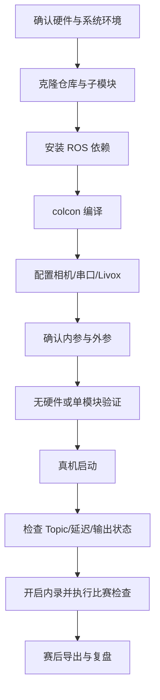

# 飞镖视觉部署实践手册

本页面向首次部署、日常调车和比赛值守。系统原理和源码阅读顺序见[飞镖视觉学习路径](02_learning_path_dart.md)，故障现象见[飞镖 Q&A](04_qa_dart.md)。

## 1. 部署流程概览



## 2. 环境与依赖

项目按 ROS 2 Humble 环境组织。部署前确认：

- Ubuntu 与 ROS 2 Humble 可正常使用。
- 海康相机驱动、Livox ROS 2 驱动及仓库子模块已经安装或拉取。
- 当前用户有相机、串口、扫码枪和 rosbag 目录的访问权限。
- 机器时间、磁盘空间和网络配置正常。

### 克隆与安装依赖

```bash
git clone --recursive https://github.com/PnX-HKUSTGZ/rmvision_dart.git
cd rmvision_dart
source /opt/ros/humble/setup.bash
rosdep install --from-paths src --ignore-src -r -y
```

如果仓库已经克隆但缺少子模块：

```bash
git submodule update --init --recursive
```

### 编译

```bash
source /opt/ros/humble/setup.bash
colcon build --symlink-install --packages-up-to rm_vision_bringup
source install/setup.bash
```


## 3. 硬件检查

### 相机

- 确认两台相机均被系统识别，且角色与物理安装位置对应。
- 相机序列号只在部署机配置中维护，不写入长期知识库。
- 确认镜头与选用的相机标定文件一致。
- 检查曝光和增益，避免绿灯过曝成白色或背景噪声过多。

### Livox

- 确认设备未被其他程序或旧的自启动进程占用。
- 检查驱动配置、frame 名称和点云发布频率。
- 在启动融合前先确认 `/livox/lidar` 持续发布。

### 串口与扫码枪

确认设备节点存在后再设置权限：

```bash
ls -l /dev/ttyACM* /dev/ttyUSB*
sudo chmod 777 /dev/ttyACM0
sudo chmod 777 /dev/ttyUSB0
```

设备名可能变化，应先识别设备再修改配置，不要默认某个编号永久有效。正式部署建议使用稳定的 udev 规则代替长期依赖 `chmod 777`。

## 4. 配置文件职责

### `launch_params.yaml`

[launch_params.yaml](../../src/vision_bringup/rm_vision_bringup/config/launch_params.yaml)负责系统结构和硬件级配置：

- 相机启动模式。
- 双相机角色、设备标识、相机名和标定文件。
- 双相机各自的 frame、外参和检测半径范围。
- 镜头档位。
- Livox 启动参数。
- 新内录开关和录制模式。

### `node_params.yaml`

[node_params.yaml](../../src/vision_bringup/rm_vision_bringup/config/node_params.yaml)负责节点行为：

- 曝光、增益和串口参数。
- 绿灯检测、PnP 和角度滤波。
- 扫码枪模式及范围校验。
- 点云累积、ROI、稳健测距和距离滤波。
- 舱门状态判断。
- `send_mux` Topic 和超时。

### 参数优先级

双相机模式下，Launch 会按 base/outpost 覆盖部分默认 Topic、frame、相机信息和半径。修改双相机硬件关系时优先修改 `launch_params.yaml`，不要只修改 `node_params.yaml` 中的兜底值。

配置修改后必须重启整套系统并记录 Git commit、配置差异和验证数据。

## 5. 标定与外参

### 相机内参

每个镜头、分辨率和相机组合都应使用对应标定结果。更换镜头或分辨率后不能沿用旧标定。

验收：

- 标定文件能够被相机节点读取。
- `camera_info` 中宽高与实际图像一致。
- 畸变校正后直线无明显异常。
- PnP 在多个已知距离下趋势正确。

### 相机—Livox 外参

双相机必须分别维护外参。标定时至少使用多个距离、多个方向和多段 rosbag 交叉验证，不能只对单帧拟合。

验收：

- 已知目标附近的点云投影与图像位置一致。
- base 和 outpost 分别验证。
- 目标距离变化时投影不会系统性漂移。
- 不通过放大 ROI 掩盖明显外参错误。

外参记录使用[外参标定记录模板](05_development_templates.md#相机-livox-外参标定记录模板)。

## 6. 启动方式

### 赛场推荐启动

```bash
cd /path/to/rmvision_dart
./dart.sh
```

[dart.sh](../../dart.sh)会加载 ROS 环境、启动视觉主程序，并按 `launch_params.yaml` 决定是否启动低优先级内录和空间清理任务。

### 只启动视觉 Launch

```bash
source /opt/ros/humble/setup.bash
source install/setup.bash
ros2 launch rm_vision_bringup vision_bringup.launch.py
```

此方式不经过 `dart.sh` 的新内录管理。

### 无硬件回放

```bash
source /opt/ros/humble/setup.bash
source install/setup.bash
ros2 launch rm_vision_bringup no_hardware.launch.py
```

无硬件模式用于验证检测链路。使用前检查回放输入、Topic 和参数是否与当前 Launch 匹配。

### systemd 自启动

[dart.service](../../dart.service)提供自启动示例。部署时必须核对：

- `User`。
- `WorkingDirectory`。
- `ExecStart` 路径。
- ROS 环境是否能在非交互 shell 中加载。

修改后执行 systemd 的标准 reload、enable 和状态检查流程，并保留可手动启动的回退方式。

## 7. 启动后验收

### 节点与 Topic

```bash
ros2 node list
ros2 topic list
ros2 topic hz /livox/lidar
ros2 topic echo /target_id --once
ros2 topic echo /Send --once
```

至少确认：

- 目标相机图像持续发布。
- 相机内参可用。
- 原始和累积点云持续发布。
- base/outpost 的 `Send_pnp` 与 `Send_fused` 存在。
- `/target_id` 能控制最终 `/Send` 的来源。
- 串口节点持续运行且 `/latency` 合理。

### 状态检查

| 状态 | 正常表现 |
| --- | --- |
| 有可用绿灯 | `light_detected=1`，输出字段随目标更新 |
| 绿灯不可见 | 不应无限保留最后一帧有效目标 |
| 舱门打开但灯被遮挡 | 满足点云证据时可输出 `light_detected=2` |
| 舱门未完全打开 | 满足近距离遮挡证据时可输出 `light_detected=3` |
| 数据源超时 | 输出进入明确的无效或未知状态，不发送陈旧数据 |

## 8. 调参顺序

一次只修改一类参数，并使用相同输入数据比较。

1. **图像质量**：曝光、增益、焦距、标定文件。
2. **二值化**：HSV 与颜色优势，确保绿灯保留且白字被抑制。
3. **几何筛选**：半径、面积、圆度、宽高比和填充率。
4. **PnP**：物理圆半径和内参。
5. **TF/外参**：先修正投影方向和系统性偏移。
6. **点云 ROI**：`roi_scale`、距离门限和角度门限。
7. **稳健测距**：最少点数和 MAD。
8. **距离滤波**：低通、死区和突变阈值。
9. **最终稳定性**：只在前面链路正确后调整。
10. **舱门判断**：用明确的开门、遮挡和未知样本验证。

记录格式见[参数调试记录模板](05_development_templates.md#参数调试记录模板)。

## 9. 内录与空间管理

新内录由 `dart.sh` 读取：

- `enable_rosbag_recorder`
- `rosbag_record_mode`

支持 `full`、`active`、`base_only` 和 `outpost_only`。比赛默认应在复盘价值与磁盘占用之间选择合适模式，并在正式上场前完成一次真实录制与导出验证。

临时覆盖示例：

```bash
ENABLE_ROSBAG_RECORDING=false ./dart.sh
ROSBAG_RECORD_MODE=full ./dart.sh
ROSBAG_CLOUD_HZ=0.5 ./dart.sh
```

空间管理和历史包压缩由 [clean_space.sh](../../RECORD/clean_space.sh)及 `dart.sh` 后台任务负责。修改空间上限前确认磁盘实际容量和其他业务占用。

## 10. 赛后导出

### 批量导出

```bash
./RECORD/extract_all_bags.sh
```

### 单包导出

```bash
python3 RECORD/extract_bag.py <bag_dir>
```

导出结果通常包括：

- base/outpost 原始视频。
- base/outpost 标注视频。
- 点云投影视频。
- `rosout.txt`。

断电包优先执行 reindex。不要直接删除原始 bag，直到导出结果完整、时间轴正确且日志可读。

## 11. 比赛前检查清单

- [ ] 当前分支、commit 和配置版本已记录。
- [ ] 编译成功且没有使用过期安装目录。
- [ ] 两台相机角色、镜头、标定文件和曝光正确。
- [ ] Livox 点云、TF 和双相机外参已验证。
- [ ] 串口收发、`target_id`、飞镖编号和偏置正常。
- [ ] base/outpost 热切换不会发送另一目标的旧数据。
- [ ] `light_detected` 各状态符合预期。
- [ ] `/latency` 在可接受范围，比赛时 `debug=false`。
- [ ] 内录开关、录制模式、保存路径和空间上限正确。
- [ ] 完成一次启动、录制、停止、导出和回放闭环。
- [ ] 已准备上一稳定版本和回滚步骤。

## 12. 更新与回滚

部署前记录：

```bash
git branch --show-current
git rev-parse HEAD
git status --short
```

更新后至少完成编译、无硬件验证、真机 Topic 验收和串口检查。出现问题时优先切换到已经验证的稳定分支或 commit，并恢复与该版本匹配的配置；不要只回退二进制而保留不兼容配置。
